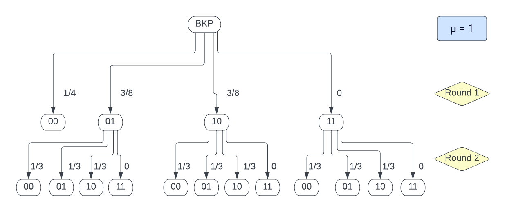
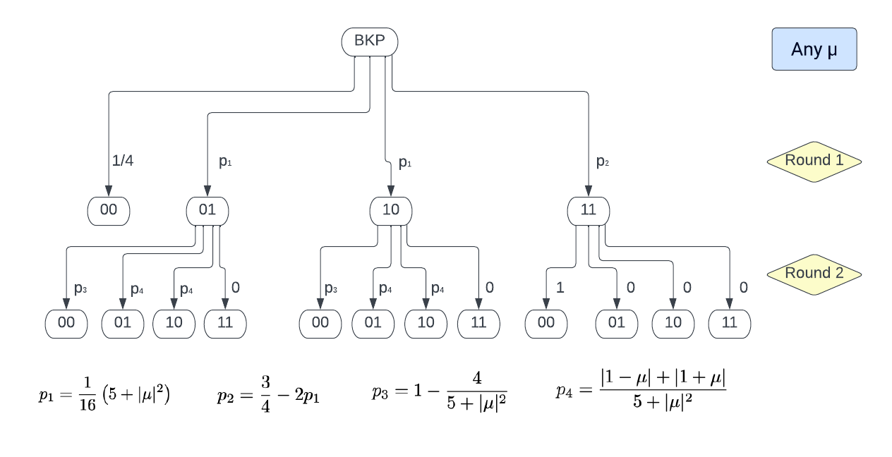
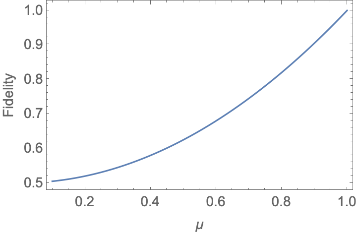

# bkp-and-visibility
## Barrett Kok protocol with non-overlapping modes

The Barrett Kok protocol can establish entanglement between two qubits even given noisy or lossy channels. In the Barrett Kok protocol (BKP), Alice and Bob each entangle their qubit with a photon, and each emit the photon towards a beamsplitter. The experimenter post-selects on detection of one or more photons from the output ports of the beamsplitter. Alice and Bob then each apply an X gate to their qubits, entangle with another photon, and again emit towards the input ports of a beamsplitter. The final entangled state, again post-selecting on detection of one or more photons, will be a fully entangled state shared between Alice and Bob. This notebook plots the fidelity of the final Bell state when the mode overlap $\mu$ for the two modes interfering in the beamsplitter during each round is not necessarily 1. 

## Probabilities of each outcome on each round
Below is a flow chart of the probabilities of each measurement outcome for each round, given a visibility of 1. In this case, the two modes will never not bunch when leaving the beamsplitter (hence probability of measuring 11 is 0). When we post-select against the outcome of 00, we'll always end up measuring either 10 or 01 (and the final shared state between Alice and Bob will be $(1/\sqrt{2}) (|e\uparrow> \pm |\uparrow e>)$. 

When $\mu$ is not necessarily 1, we now have a non-zero probability that the two modes may exit different ports of the beamsplitter. However, given this does happen, the measurement during round 2 will always be 00, which we post-select against. Somewhat counter-intuitively then, we still end up measuring either 10 or 01 on the final round. 

However, the final shared state between Alice and Bob will not be exactly $(1/\sqrt{2}) (|e\uparrow> \pm |\uparrow e>)$.  in the case where visibility is not 1; the fidelity of the final Bell state drops. Below is a plot of the fidelity of the final shared state between Alice and Bob vs mode overlap $\mu$. 

## References
Sean D Barrett and Pieter Kok. "Efficient high-fidelity quantum computation using matter qubits and linear optics." Physical Review A 71, 6 (2005), 060310.

Axel Dahlberg et al. "A Link Layer Protocol for Quantum Networks." 2019. https://arxiv.org/pdf/1903.09778.pdf
